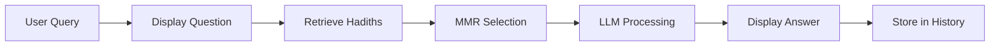

Once you've installed dependencies, prepared your data, and configured API keys, you're ready to run the DeenPAL chatbot.

## Starting the Application

<Steps>
  <Step title="Activate Environment">
    Ensure your conda environment is activated:
    
    ```bash
    conda activate deen-pal
    ```
  </Step>

  <Step title="Navigate to Project Directory">
    Change to the project root directory:
    
    ```bash
    cd DeenPAL-RAG-based-Islamic-Hadith-Chatbot
    ```
  </Step>

  <Step title="Start Streamlit Server">
    Run the Streamlit application:
    
    ```bash
    streamlit run app.py
    ```
    
    You should see output similar to:
    ```
    You can now view your Streamlit app in your browser.
    
    Local URL: http://localhost:8501
    Network URL: http://192.168.1.x:8501
    ```
  </Step>

  <Step title="Access the Interface">
    Open your web browser and navigate to:
    
    ```
    http://localhost:8080
    ```
    
    <Note>
    If port 8080 is not available, Streamlit may use port 8501 or another port. Check the terminal output for the correct URL.
    </Note>
  </Step>
</Steps>

## First Run: Data Loading

On the first run, you'll see console output indicating data preparation:

```
1- Loading Hadith PDFs
2- Documents loaded successfully.
3- Documents split and metadata added.
4- Chroma vector store initialized.
```

This process:
- Loads all PDFs from the `data/` directory
- Extracts and processes metadata
- Splits text into semantic chunks
- Downloads the embedding model (if not cached)
- Generates embeddings for all chunks
- Stores embeddings in ChromaDB

<Warning>
The first run may take several minutes depending on:
- Number and size of PDF files
- Internet speed (for downloading the embedding model)
- System resources (CPU/RAM)

Subsequent runs will be much faster due to caching.
</Warning>

## Using the Chat Interface

### Interface Overview

The DeenPAL interface consists of:

1. **Title Bar:** "Deen Pal Chatbot"
2. **Chat History:** Scrollable conversation display
3. **Input Box:** Text field at the bottom for typing questions
4. **Submit:** Press Enter or click the send button

### Asking Questions

<Steps>
  <Step title="Type Your Question">
    Click the input box at the bottom and type your question:
    
    ```
    What does Islam say about patience?
    ```
  </Step>

  <Step title="Submit">
    Press **Enter** or click the send button to submit your query.
  </Step>

  <Step title="Wait for Response">
    The chatbot will:
    1. Display your question in the chat
    2. Retrieve relevant Hadiths from the vector database
    3. Generate a response using the LLM
    4. Display the answer with citations
  </Step>
</Steps>

## Example Queries

Here are some example questions you can ask:

### General Guidance
```
What does Islam teach about honesty?
```

### Specific Topics
```
Find Hadiths about prayer and its importance
```

### Comparative Questions
```
What is the difference between obligatory and voluntary fasting?
```

### Seeking Wisdom
```
What advice does the Prophet Muhammad (PBUH) give about treating neighbors?
```

<Note>
**Response Format:**

The chatbot typically responds with:
1. Relevant Hadith citations (Book, Chapter, Number)
2. The Hadith text
3. A brief explanation
4. Direct answer to your question
</Note>

## Chat History Functionality

DeenPAL maintains conversation context within a session:

```python app.py
if "messages" not in st.session_state:
    st.session_state.messages = []
```

### How It Works

1. **Storage:** All messages are stored in `st.session_state.messages`
2. **Display:** On each interaction, the full history is displayed
3. **Context:** Previous messages are included in the RAG chain invocation

```python app.py
response = rag_chain.invoke({
    "input": prompt,
    "chat_history": st.session_state.messages
})
```

### Benefits

- **Contextual Responses:** The chatbot understands follow-up questions
- **Persistent Conversation:** The full conversation remains visible
- **Reference Previous Answers:** You can refer back to earlier topics

### Clearing History

To start a fresh conversation:
1. Refresh the browser page
2. Or restart the Streamlit server

<Note>
Chat history is only maintained within a browser session. Closing the browser or refreshing the page clears the history.
</Note>

## Understanding the Response Flow

Here's what happens when you submit a query:



1. **User Query:** You type and submit a question
2. **Display Question:** The question appears in the chat
3. **Retrieve Hadiths:** Vector similarity search finds relevant Hadiths
4. **MMR Selection:** Maximal Marginal Relevance selects diverse results
5. **LLM Processing:** The language model generates a response
6. **Display Answer:** The answer appears in the chat
7. **Store in History:** Both question and answer are saved

## Performance Considerations

### Response Time

**First Query:**
- Slower due to model initialization
- May take 5-15 seconds

**Subsequent Queries:**
- Faster due to caching
- Typically 2-5 seconds

### Factors Affecting Speed

- **Number of retrieved Hadiths (k):** More results = slower processing
- **LLM provider:** Different providers have different response times
- **Internet connection:** Required for API calls
- **System resources:** CPU/RAM affect local processing

## Troubleshooting Common Issues

### Application Won't Start

**Error:**
```
ModuleNotFoundError: No module named 'streamlit'
```

**Solution:**
```bash
pip install -r colab_requirements.txt
```

### Port Already in Use

**Error:**
```
OSError: [Errno 98] Address already in use
```

**Solution:**
```bash
streamlit run app.py --server.port 8502
```

### No Response from Chatbot

**Possible Causes:**
1. **API Key Issue:** Check `.env` file
2. **No Data:** Ensure PDFs are in `data/` directory
3. **Network Error:** Verify internet connection

**Debug Steps:**
```bash
# Check if .env exists
ls -la .env

# Check if data directory has PDFs
ls -la data/

# Check console output for errors
# (Look at terminal where streamlit is running)
```

### ChromaDB Error

**Error:**
```
chromadb.errors.InvalidDimensionException
```

**Solution:**
Delete the existing database and restart:
```bash
rm -rf database/chroma_db
streamlit run app.py
```

### Slow First Load

**Cause:** Downloading embedding model and processing PDFs

**Solution:**
- Be patient on first run
- Ensure stable internet connection
- Consider using fewer/smaller PDFs initially

### Memory Issues

**Error:**
```
MemoryError: Unable to allocate array
```

**Solutions:**
1. Reduce number of PDFs
2. Increase system RAM
3. Lower `fetch_k` parameter in `chains.py`

## Stopping the Application

To stop the Streamlit server:

1. Return to the terminal where it's running
2. Press **Ctrl+C**
3. Wait for graceful shutdown

```bash
Shutting down gracefully...
Streamlit server stopped.
```

## Advanced Usage

### Running on a Custom Port

```bash
streamlit run app.py --server.port 9000
```

### Running on All Network Interfaces

```bash
streamlit run app.py --server.address 0.0.0.0
```

### Disabling Auto-Reload

```bash
streamlit run app.py --server.fileWatcherType none
```

### Production Deployment

For production use, consider:

1. **Use a production WSGI server**
2. **Add authentication**
3. **Set up HTTPS**
4. **Configure resource limits**
5. **Implement logging**

<Warning>
Streamlit's development server is not designed for production use. For production deployments, consult the [Streamlit deployment documentation](https://docs.streamlit.io/streamlit-community-cloud/deploy-your-app).
</Warning>

## Next Steps

Now that you're running DeenPAL:

1. Experiment with different types of questions
2. Adjust retriever parameters for optimal results
3. Customize prompts to match your use case
4. Add more Hadith collections to expand coverage